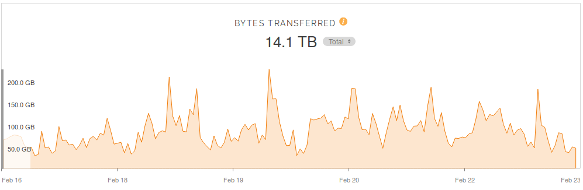

# Trying out the Wasabi cloud storage

[Wasabi][] is a company that provides Object Storage. An Amazon S3-compatible
storage as a service, but much cheaper. They have a relationship with
[Packet][], and Packet is providing servers for the NixOS Foundation so that
would be perfect for us.

cache.nixos.org

The current Nix binary cache is hosted on S3 and served by Fastly and it works
quite well (except for some recurring IPv6 issues). But if we can find a
cheaper place to host, it would be great.

Before diving into the numbers, here is a snapshot of our stats on Fastly.

## Fastly stats




## Estimated S3 pricing

### Storage

#### S3 Standard Storage

* First 50 TB / Month	$0.023 per GB
* Next 450 TB / Month	$0.022 per GB
* Over 500 TB / Month	$0.021 per GB

#### S3 Standard-Infrequent Access (S3 Standard-IA) Storage

* All storage / Month	$0.0125 per GB
* 
#### S3 One Zone-Infrequent Access (S3 One Zone-IA) Storage

* All storage / Month	$0.01 per GB
#### S3 Glacier Storage

All storage / Month	$0.004 per GB

* storage:
* GET request: $0.0004
* egress: $0.085 per GB

Data Transfer OUT From Amazon S3 To Internet
Up to 1 GB / Month 	$0.00 per GB
Next 9.999 TB / Month 	$0.09 per GB
Next 40 TB / Month 	$0.085 per GB
Next 100 TB / Month 	$0.07 per GB
Greater than 150 TB / Month 	$0.05 per GB


## Estimated Wasabi pricing

* storage: $.0049 / GB / month
* egress: free
* GET requests: free

## Usage

`$ nix copy --to s3://nix-copy-test?endpoint=s3.eu-central-1.wasabisys.com nixpkgs.hello`
```

```
HTZ1ZFD4L009181HIC0O

`! AWS_ACCESS_KEY_ID=HTZ1ZFD4L009181HIC0O`
`! AWS_SECRET_ACCESS_KEY=GFEtwZqeDByjKvVIv5DLlDT4MJw295Na25YNl5zt`


[Wasabi]: https://wasabi.com
[Packet]: https://packet.net
